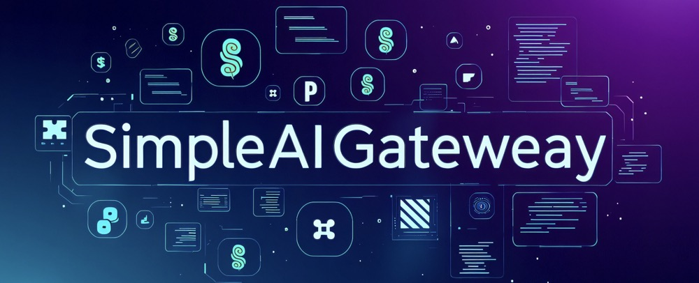

# SimpleAIGateway [中文介绍](README_zh.md)
This is a simple AI gateway implemented in Python, featuring dynamic configuration, load balancing, error alerts, disaster recovery, and persistent request logging.

The motivation behind this project is that I deployed multiple instances of LLM models using VLLM, but I wanted to access these models through a unified gateway while also implementing dynamic configuration, load balancing, error alerts, disaster recovery, and request logging backup.

After a brief search, I found that most existing projects are client-side aggregation calls, and there are few that provide model gateway functionality on the server side.

While some projects can achieve similar functionalities, they often require complex configurations and environment dependencies, which didn't quite meet my needs. Therefore, I decided to develop this simple AI gateway using Python.

If this project is helpful to you, feel free to star or fork it, and pull requests are also welcome.

If you find any better open-source projects that fulfill the above features, please let me know in the issues section :)

## Features
- **Simple and Easy to Use:** This AI gateway is written in pure Python code with only a few hundred lines, compatible with the OpenAI API interface, and supports both streaming and non-streaming output.
- **Dynamic Configuration Loading:** Newly added deployment instances can be configured by directly modifying the configuration file without affecting online client usage.
- **Load Balancing Support:** Load balancing across multiple instances can be achieved through strategies such as round-robin or least connections.
- **Fallback Instance Configuration:**  Fallback instances (like external APIs) can be configured for disaster recovery, preventing impact on online business if all privately deployed instances go down.
- **Request Logging and Persistence:** Requests and responses passing through the AI gateway are automatically written to files, saved hourly in sharegpt format, facilitating subsequent model training.
- **Monitoring and Alerting:** (This feature currently only writes error information to log files. You can add internal alerting mechanisms like WeChat messages or emails based on your own needs).
- **Allows easy configuration of policies**  Enabling features like context length limits, prompt filtering and optimization, and risk management of model output results on the gateway. (Requires custom development)

## Quick Start
### Environment Preparation:
 `pip install asyncio json5 aiohttp uvicorn fastapi pydantic watchdog openai`
 ### Start Service:
 1. Modify the configuration file `config.json5` to configure AI model addresses, ports, load balancing strategy, etc.
 <details>
 <summary>Click to expand configuration file example</summary>

 ```json5
 {
    "instances": [ // private instances for inference
      {
        "url": "http://10.82.1.1:8080/v1",
        "api_key": "empty",
        "model_name": "deepseek-r1",
        "weight": 1
      },
       {
       "url": "http://10.82.1.2:8080/v1",
       "api_key": "empty",
       "model_name": "deepseek-r1",
       "weight": 1
      }
    ],
    "fallback_instances":[  // optional, fallback instances in case of all private instances are down
      {
        "url": "https://cloud.infini-ai.com/maas/v1",
        "api_key":"your_api_key",
        "model_name": "deepseek-r1",
        "weight": 1
      }
    ],
    "data_dir": "./data",
    "load_balancing_strategy": "round_robin", // options: round_robin, least_connections
    "error_threshold": 10,  // number of consecutive errors before remove this server from the pool
    "error_window": 300, // time window for error count
    "alert_cooldown": 300 // time window for alerting
  }
  ```
  </details>

 2. Start the service: `python model_gateway.py`
 3. Access the gateway service: `http://your_model_gateway_ip:9999/`
 4. Example call, completely consistent with standard VLLM or OpenAI API interface calls:
 <details>
 <summary>Click to expand example code</summary>

 ```python
from openai import OpenAI
import time
import concurrent
import traceback
MODEL_NAME = 'deepseek-r1'
ip_mapping = {
    'deepseek-r1':"http://your_model_gateway_ip:9999/v1",
              }
url = ip_mapping[MODEL_NAME]
client = OpenAI(
    base_url=url,
    api_key="EMPTY",
)

def call_one_req(messages=None, stream=False, print_process=False):
    try:
        start_time = time.time()
        completion = client.chat.completions.create(
            model=MODEL_NAME,
            messages=[
                {"role": "user", "content": "1+1=？ "},
            ] if messages is None else messages,
            temperature=0.6,
            stream=stream,
            max_tokens=4096
        )
        result = ''
        if stream:
            for chunk in completion:
                if len(chunk.choices)>0:
                    reasoning_content = chunk.choices[0].delta.reasoning_content if hasattr(chunk.choices[0].delta,"reasoning_content")  else None
                    answer_content = chunk.choices[0].delta.content
                    tmp = reasoning_content if reasoning_content is not None else answer_content
                    result += tmp
                    if print_process:
                        print(tmp, end='', flush=True)
        else:
            result = completion.choices[0].message.content
            if print_process:
                print(result)
        return result
    except:
        traceback.print_exc()
        print("error")
        return None
messages = [{'role':'user','content':'hello.'}]
call_one_req(messages,stream=True, print_process=True)
```
</details>

5. Access log files: All call requests and model responses will be saved in `data/requests_responses/YYYYMMDD_HH.jsonl` files, with one file saved per hour in sharegpt format, convenient for subsequent model training.

## Risks
1. This project currently only confirms support for the OpenAI API interface. Other interfaces have not been tested and may have compatibility issues.
2. The code has not been tested in large-scale, high-traffic scenarios, and it is uncertain whether there are performance issues.
